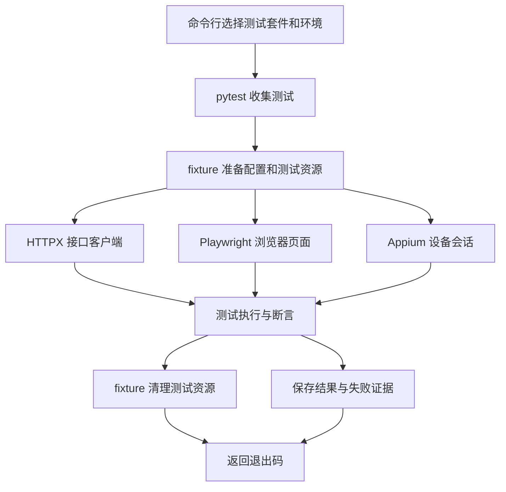

# 02 · 读懂架构与目录

框架的核心是“不同自动化共用 pytest，操作细节分开封装”。新增业务时，你主要修改测试、业务对象、数据和环境配置。

## 1. 一次运行经过哪些步骤



退出码 `0` 代表本次执行成功；非 `0` 代表失败、执行错误或没有收集到测试等情况。CI 就依靠这个数字决定构建是否通过。

## 2. 目录职责

```text
项目根目录/
├── pyproject.toml           # 包信息、依赖范围、pytest/Ruff 配置
├── uv.lock                  # 已解析的确切依赖版本，提交到 Git
├── .env.example             # 环境变量示例，复制后填真实值
├── configs/
│   └── environments/        # demo、test、staging 等环境的普通配置
├── src/autotest/            # 可复用的框架代码
│   ├── api/                 # 请求封装和接口业务对象
│   ├── web/                 # 浏览器页面对象
│   ├── mobile/              # App 驱动与页面对象
│   ├── ai.py                # AI 命令和模型适配
│   └── pytest_plugin.py     # 配置、fixture 和报告钩子
├── conftest.py              # 注册项目级 pytest 插件
├── tests/
│   ├── unit/               # 框架自身的单元测试
│   ├── api/                # 接口业务验证
│   ├── web/                # 浏览器业务验证
│   ├── app/                # 真机 / 模拟器业务验证
│   └── data/               # 非敏感测试数据与参数化数据
├── artifacts/              # 每次执行报告、日志和附件，不提交到 Git
├── docs/                   # 使用和维护手册
├── .github/workflows/      # GitHub Actions 配置
└── Jenkinsfile             # Jenkins 流水线示例
```

更精确的文件名称以当前仓库为准。框架底层常用工具放 `src/autotest/`，业务用例放 `tests/`。随着公司项目增多，可以逐步抽取公共包，第一次接入不用急着引入多个仓库。

## 3. 四层分别写什么

| 层 | 例子 | 变化时该改哪里 |
| --- | --- | --- |
| 测试用例 | “正确账号能登录，错误密码返回明确提示” | 产品规则变化时修改用例和断言 |
| 页面 / 业务对象 | `LoginPage.login()`、订单服务的创建方法 | UI 定位或接口路径变化时修改对象 |
| 客户端与 fixture | 建立浏览器、设置超时、关闭 HTTP 连接 | 运行机制变化时修改底层 |
| 数据与配置 | URL、账号来源、输入与预期值 | 换环境或增加边界值时修改配置 / 数据 |

例如登录按钮的文本从“登录”改成“立即登录”：如果按钮定位只放在 `LoginPage` 中，只改这一个地方；所有调用页面对象的用例就会使用新定位。

如果需求把“密码错误返回 401”改成 400，需要确认接口契约变化后修改断言。页面对象和 AI 都不应擅自把错误结果改成通过。

## 4. fixture 是什么

fixture 可以理解为 pytest 自动管理的“准备和收尾函数”。测试函数在参数中写出 fixture 名称，pytest 就会先运行它并传入结果，不需要自己调用它。

```python
import pytest


@pytest.fixture
def account():
    # yield 前：准备数据。这里仅用普通字典说明原理。
    user = {"username": "demo", "password": "demo123"}
    yield user  # 这个 user 会变成下方测试函数的 account 参数。
    # yield 后：收尾。例如删除刚创建的测试账号。


def test_account_has_username(account):
    # pytest 看见 account 参数，就自动调用上面的 fixture。
    assert account["username"] == "demo"
```

常用作用域：`function` 每条测试各一份，隔离最好；`session` 整次 pytest 进程共用一份，适合服务进程等昂贵资源。启用 `-n 2` 后会启动两个 worker，每个 worker 有自己的 session，**不会跨进程共享 Python 对象**。

本项目中常用 fixture：

- `settings`：解析后的环境配置。
- `api_client`：可发送接口请求的客户端，测试结束后关闭连接。
- `base_url`：Web 当前环境地址。
- `page`：Playwright 页面，由插件创建和清理；每条测试有独立浏览器上下文。
- App fixture：参见 [App 接入](04-app.md)，按显式启用配置创建设备会话。

浏览器上下文类似一个独立用户的浏览器会话：Cookie 与存储隔离，底层浏览器程序可以复用。

## 5. 环境配置

用 `--env demo` 运行本地练习，用 `--env test` 或 `--env staging` 读取相应 YAML。命令行环境名优先于 `TEST_ENV`；选定环境后，`API_BASE_URL`、`WEB_BASE_URL`、`API_TOKEN` 等环境变量覆盖对应文件配置。没有指定环境时默认 `demo`。

```powershell
# 环境变量只对当前 PowerShell 及其启动的进程生效。
$env:API_BASE_URL = "https://api.test.example.com"
$env:WEB_BASE_URL = "https://web.test.example.com"
uv run python -m autotest run --suite api -- --env test

# 完成后清除本次手工覆盖，避免下一次误用公司地址。
Remove-Item Env:API_BASE_URL
Remove-Item Env:WEB_BASE_URL
```

改环境只是换地址和运行配置。仓库中的演示业务带 `demo` 标记，在非 demo 环境自动跳过，因此看到全是 `skipped` 不代表验证了公司系统。新增公司用例时不要加 `demo` 标记，并按真实业务实现路径与断言，详细步骤见 [迁移手册](06-new-project.md)。

## 6. 数据与并行

每条测试尽量自己创建数据，用唯一名称区分，例如 `f"order-{uuid4().hex[:8]}"`。在 `finally` 或 fixture 的 `yield` 后清理，测试断言失败时也会清理。

共享一个固定手机号、订单编号或账号时，并行测试可能互相修改数据。先串行确认正确，再为每个 worker 分配独立账号和数据空间。App 并行还需要每个 worker 对应独立设备、端口和驱动会话，不能只在一台手机上加 `-n 4`。

## 7. 推荐的维护方式

1. 遇到一个真实失败，保留本次报告、版本、环境信息和复现步骤。
2. 分清是产品问题、测试代码问题、数据污染还是环境问题。
3. 如果是定位变化，修改对应页面对象；如果是鉴权变化，修改服务 / 客户端。
4. 先复跑失败用例，再跑受影响的一组测试。
5. 审查修改与报告一起提交。不要默认重试掩盖随机失败。

下一步：[开始编写用例](03-writing-tests.md)。
